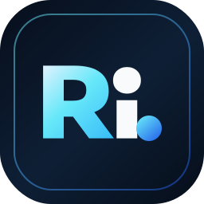

# <div align="center">sadirov.dev</div>

<div align="center">
  
  <br />
  <br />
  
</div>

<div align="center">

[](https://github.com/sadirovabduloh-ux/sadirov-portfolio)

</div>

<div align="center">

[](https://sadirov.dev)
[](https://edu-tc.vercel.app/)
[](https://react.dev/)
[](https://vite.dev/)
[](https://tailwindcss.com/)
[](https://www.framer.com/motion/)

</div>

---

## Overview

This repository contains the source code for **sadirov.dev**: a premium portfolio website for **Abdulloh Sadirov**, positioned as a:

- Fullstack Developer
- AI/ML Engineer
- Web Systems Builder

The goal of this project is to create a portfolio that feels:

- clean like Apple
- cinematic and futuristic
- minimal but not empty
- technically strong for recruiters and founders
- responsive across mobile, tablet, and desktop

---

## What Makes It Strong

- **Cinematic hero section** with personal branding and motion-first composition
- **Responsive layout system** refined for phones, tablets, and large screens
- **Premium project cards** with custom visual previews, including `EduTC`
- **Dark glassmorphism aesthetic** with subtle neon depth
- **Data-driven content structure** for easier scaling and editing
- **Reusable UI primitives** for buttons, tags, and layout consistency

---

## Visual Direction

This portfolio was designed to communicate:

- strong frontend engineering
- scalable backend thinking
- AI-powered product mindset
- premium startup-level execution

The interface uses:

- dark navy surfaces
- cyan / blue glow accents
- glass layers
- bold editorial typography
- smooth spacing and high-contrast hierarchy

---

## Tech Stack

### Frontend

- React 19
- Vite 8
- Tailwind CSS 4
- Framer Motion
- Lucide React

### UI Utilities

- class-variance-authority
- clsx
- tailwind-merge
- Radix Slot

---

## Sections Included

- **Hero**: cinematic introduction and developer identity
- **About**: positioning, philosophy, and product mindset
- **Skills**: frontend, backend, databases, DevOps, AI/ML, tools
- **Projects**: curated portfolio work with focused previews
- **Journey**: growth timeline from frontend to AI/fullstack systems
- **Contact**: professional outreach entry points

---

## Featured Project

### EduTC Platform

EduTC is presented as the lead portfolio project and links to the real demo:

[https://edu-tc.vercel.app/](https://edu-tc.vercel.app/)

Its card preview was custom-built to reflect:

- glass UI styling
- mobile-native product feel
- educational product branding
- premium dashboard-like composition

---

## Local Development

```bash
bun install
bun run dev
```

Open the local URL shown by Vite in your terminal.

---

## Production Build

```bash
bun run build
```

To preview the production build locally:

```bash
bun run preview
```

---

## Project Structure

```text
src/
├── assets/
├── components/
│   └── ui/
├── data/
├── lib/
├── App.jsx
├── index.css
└── main.jsx
```

---

## Brand Identity

**Name:** Abdulloh Sadirov  
**Brand:** sadirov.dev  
**Role:** Fullstack Developer • AI/ML Engineer

---

## Contact

- Email: [sadirovabduloh@gmail.com](mailto:sadirovabduloh@gmail.com)
- LinkedIn: [abdulloh-sadirov-96274b399](https://linkedin.com/in/abdulloh-sadirov-96274b399)
- Telegram: [@sadirovdev](https://t.me/sadirovdev)

---

## Repository Goal

This repository is not just a code dump.  
It is a **personal technical identity system** designed to show how Abdulloh thinks about:

- product design
- frontend architecture
- scalable fullstack delivery
- AI-enhanced web experiences

---

<div align="center">
  
  <br />
  <strong>sadirov.dev © 2026</strong>
</div>
